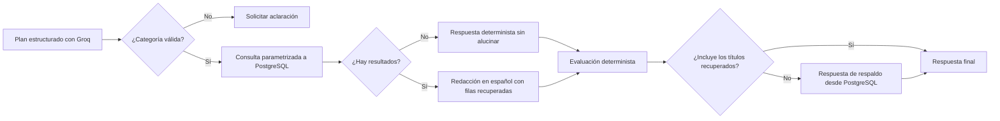

# Chatbot de películas y videojuegos

Aplicación Python con PostgreSQL y un flujo LangGraph para contestar preguntas usando el catálogo existente. La integración parte del ejercicio Python/Groq del curso; no depende de Google Colab ni publica un enlace `share=True`.

## Desarrollo con SDD

El trabajo se organiza como especificación → plan → tareas → implementación. Consulta [specs/README.md](specs/README.md) para el flujo y [specs/02-roadmap.md](specs/02-roadmap.md) para el estado. `pf.md` conserva el enunciado original; las specs convierten sus requisitos en incrementos implementables. El primer incremento web en curso es [F-001: aplicación web y autenticación](specs/features/001-authentication/spec.md).

## Requisitos locales

- Python 3.11 o posterior.
- PostgreSQL local con las tablas `public.peliculas` y `public.videojuegos` ya pobladas.
- Una clave de Groq para llamadas de IA.

DBeaver es el cliente de inspección; la aplicación se conecta directamente a PostgreSQL usando `DATABASE_URL`.

## Preparar entorno

```bash
python3 -m venv .venv
source .venv/bin/activate
python -m pip install --upgrade pip
python -m pip install -e .
cp .env.example .env
```

Edita `.env` y coloca una clave propia en `GROQ_API_KEY`. El archivo `.env` está excluido de Git. Si la conexión local requiere contraseña en otra computadora, ajústala solo en ese archivo.

Para iniciar la web, define `SECRET_KEY` con un valor aleatorio propio de al menos 32 caracteres en `.env`; no uses una clave compartida ni la subas a Git. Puedes generar uno desde la terminal:

```bash
python -c 'import secrets; print(secrets.token_hex(32))'
```

En despliegues HTTPS, configura `SESSION_COOKIE_SECURE=true`.

## Iniciar la aplicación web

La primera cuenta se crea localmente con el comando `create-admin`. Escribe el nombre y correo cuando los solicite; la contraseña se captura de forma oculta y no se proporciona como argumento del comando. Se requiere una contraseña de al menos 10 caracteres y no se crea otra cuenta inicial si ya existe una con rol `admin`.

```bash
create-admin
seminario-web
```

Si ya habías instalado el proyecto antes de agregar esos comandos, actualiza la instalación con `python -m pip install -e .`.

Abre `http://127.0.0.1:5000` e inicia sesión con la cuenta recién creada. El comando web usa `127.0.0.1:5000` por defecto; se puede cambiar con `FLASK_HOST` y `FLASK_PORT`. La base de datos debe tener aplicada la migración aditiva `database/001_support_tables.sql`.

La pantalla privada y el panel administrativo forman el primer incremento web. El CRUD de cuentas y catálogos, el chat web, el historial y la gráfica se incorporarán en los siguientes incrementos.

## Explorar el flujo

Imprime el grafo sin llamar al modelo:

```bash
catalog-chat --show-graph
```

Haz una consulta completa contra PostgreSQL:

```bash
catalog-chat "¿Cuáles son 3 películas de drama?"
catalog-chat "¿Qué videojuegos de disparos tienen calificación mayor a 8.5?"
```

El comando presenta respuesta, filtros inferidos, resultados, veredicto del evaluador y consumo aproximado en palabras. Una palabra se cuenta como un token según la regla académica del proyecto; también se conserva el uso real que reporte Groq para comparación.

## Flujo LangGraph



Cada llamada crea un estado nuevo y el grafo no usa checkpointer, por lo que una pregunta no recibe memoria de preguntas anteriores. El modelo devuelve filtros Pydantic; el código aplica límites, mapea géneros y compone SQL con parámetros. El modelo nunca crea ni ejecuta SQL.

## Evaluar cambios al planificador

Hay casos iniciales en `data/ai_eval_cases.jsonl`. El comando siguiente llama una vez a Groq por caso y compara categoría, género, calificación y límite contra los valores esperados:

```bash
evaluate-chat-plans
```

Esto puede consumir cuota de la API. Ejecuta el comando al cambiar el prompt o el modelo; no forma parte del arranque normal de la aplicación.

## Esquema SQL de soporte

`database/001_support_tables.sql` añade las tablas de usuarios, conversaciones, mensajes y consumo. Ya se aplicó a la base local `postgres`; los catálogos quedaron intactos. En una base nueva, primero confirma los nombres y columnas de catálogo, luego aplica la migración desde la raíz del proyecto:

```bash
psql "$DATABASE_URL" -v ON_ERROR_STOP=1 -f database/001_support_tables.sql
```

Los cambios futuros al esquema deben ir en una migración numerada nueva, no en la migración ya aplicada.

## Estado de esta etapa

La capa de IA y el acceso seguro de solo lectura a los catálogos ya están preparados. F-001 incorpora las primeras pantallas Flask, el login/logout y la autorización por rol; su revisión en ejecución queda pendiente. Los siguientes incrementos añadirán CRUD administrativo, chat web, historial privado y gráfica de consumo.

## Material de referencia

Los documentos y el notebook originales del curso están en [docs/references](docs/references/README.md). El notebook sirve como referencia del laboratorio; la aplicación web no depende de Google Colab ni de Gradio.
